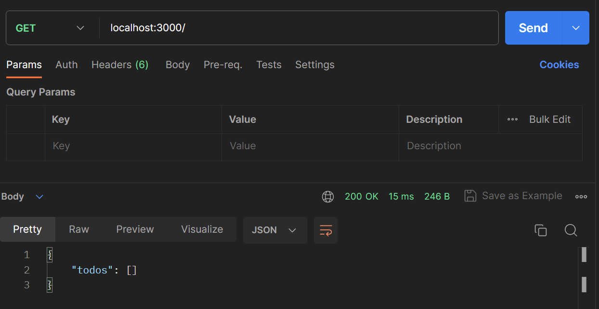
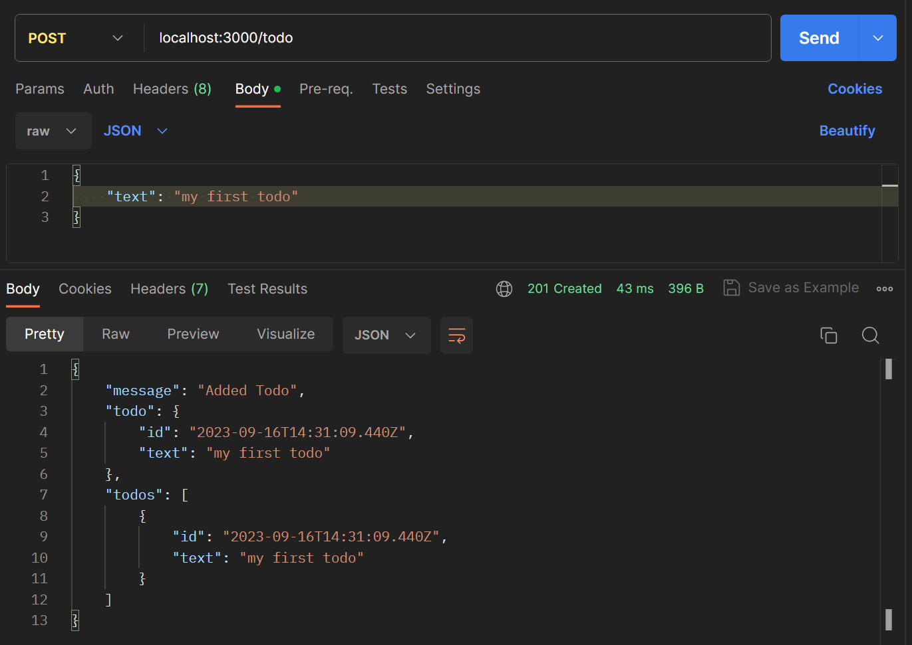
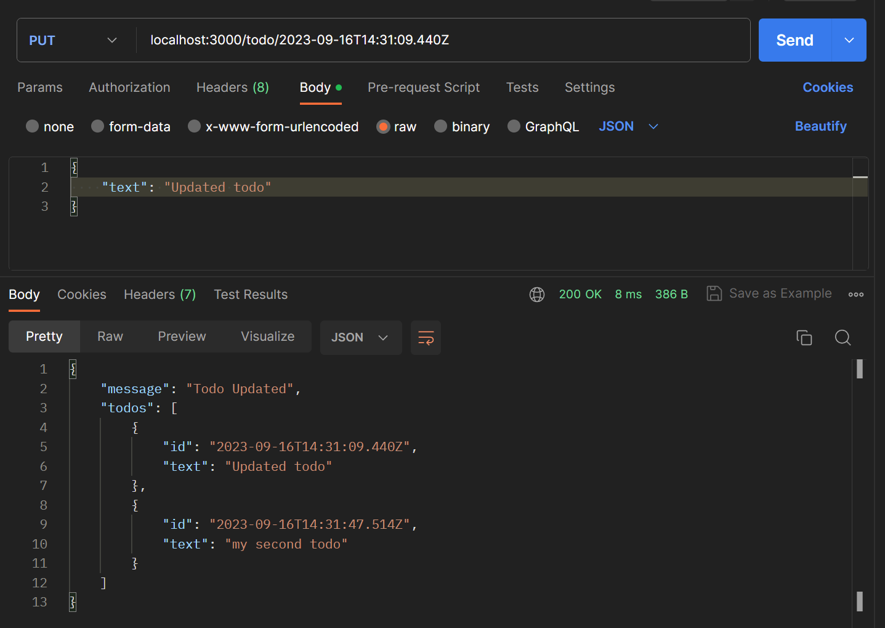
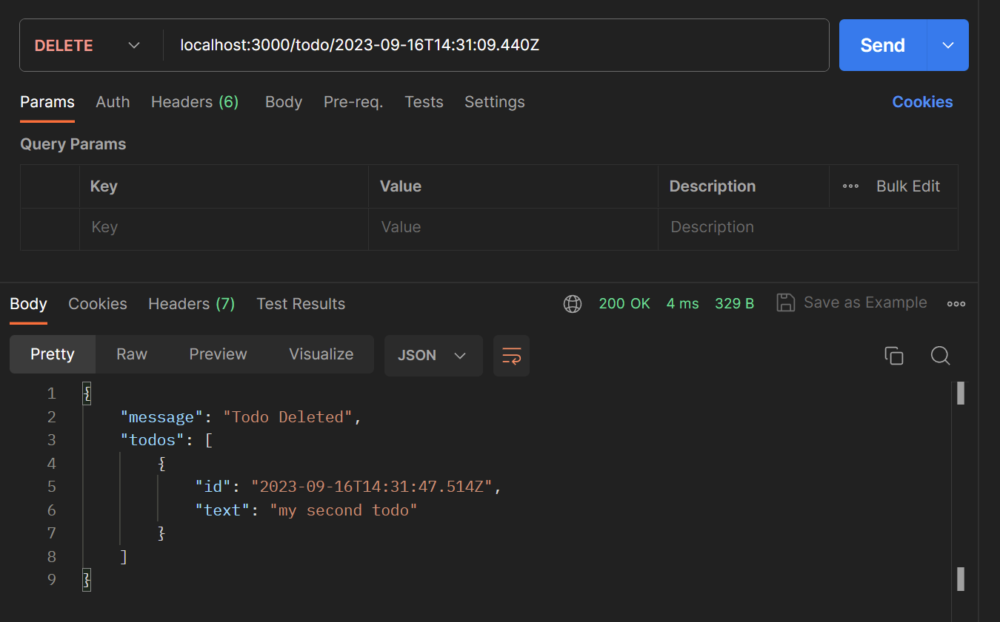

#### Below are the steps how to set up a basis `express` app, which exposes
#### REST API with `GET`, `POST`, `PUT` and `DELETE` routes using `Typescript`

<details open>
 <summary style="font-size: x-large; font-weight: bold">Basic Setup</summary>

### 1. Initialize the project
```
npm init
```

### 2. Create tsconfig.json file
Below cmd will create tsconfig.json file
```
tsc init
```

### 3. Install `express` and `body-parser`
```
npm i --save express body-parser
```

### 4. Add basic express set up
Add `app.ts` to root folder
```typescript
const express = require('express');

const app = express();

app.listen(3000);
```
### 5. Resolve `require` issue
To resolve the error for `require` install below dependency,
which let us use node.js specific  syntax in our typescript files
```
npm i --save-dev @types/node
```

### 6. Do the above step for other packages also
For many popular library we get `@types` as a dependency to which let us 
write node.js code in typescript file. Also doing this gives us suggestion in 
our IDE when we write code in typescript

```
npm i --save-dev @types/express @types/body-parser
```

### 7. Update one more thing to get suggestion in IDE
So just installing `@types/express` will not give us suggestion in IDE for
3rd party library.
We also need to change how we import our library. Typescript is tune to work
for web application and we don't use `require` in out code there.

Do below step to resolve this issue
#### i. Update `tsconfig.json` file
```json
{
  "compilerOptions": {
    "target": "es6", //modern typescript version
    "moduleResolution": "node"
  }
}
```
#### ii. Update `app.ts` file
```typescript
import express from "express";
```

</details>


<details >
 <summary style="font-size: x-large; font-weight: bold">Setting up REST API</summary>

### 1. Create `routes/todos.ts` file
```typescript
/**
 * Import whole module from `express` then create router
 *
 * import express from "express";
 * const router = express.Router();
 */

/**
 * Or just import what is required...
 */
import { Router } from "express";

const todos = [];
const router = Router();

router.get("/", (req, res, next) => {
    res.status(200).json({todos: todos});
});

export default router;
```

### 2. Update `app.ts` file

```typescript
import todosRoutes from "./routes/todos";

const app = express();

app.use(todosRoutes);
```

### 3. Resolve type issue with `const todos = []`

#### i. Create `models/todo.ts` file
```typescript
export interface Todo {
    id: number;
    text: string;
}
```

#### ii. Update `routes/todos.ts` file
```typescript
import { Todo } from "../models/todo";

const todos: Todo[] = [];
```

### 4. Add `body-parser` to `app.ts`

```typescript
import bodyParser from "body-parser";

app.use(bodyParser.json());
```

### 5. Create post `/todo` route
```typescript
router.post("/todo", (req, res, next) => {
    const newTodo: Todo = {
        id: new Date().toISOString(),
        text: req.body.text
    };
    
    todos.push(newTodo);

    res.status(201).json({message: "Added Todo", todo: newTodo, todos: todos});
})
```

### 6. Create put `/todo/:todoId` route
```typescript
router.put("/todo/:todoId", (req, res, next) => {
    const tid = req.params.todoId;
    const todoIndex = todos.findIndex((todoItem) => todoItem.id === tid);
    if(todoIndex >= 0) {
        todos[todoIndex].text = req.body.text;
        return res.status(200).json({message: "Todo Updated", todos: todos});
    }

    res.status(404).json({message: "Could not find todo with id: " + tid});
})

```

### 7. Create delete `/todo/:todoId` route
```typescript
router.delete("/todo/:todoId", (req, res, next) => {
    todos = todos.filter((todoItem) => todoItem.id !== req.params.todoId);
    res.status(200).json({message: "Todo Deleted", todos: todos});
});
```
</details>

<details >
 <summary style="font-size: x-large; font-weight: bold">Test API</summary>

### 1. Run below command to compile typescript files to js
```bash
tsc
```

### 2. Run below command to start the server
```bash
node app.js
```

### 3. Visit http://localhost:3000 on Postman
#### i. GET


#### ii. POST


#### iii. PUT


#### iv. DELETE


</details>

<details >
 <summary style="font-size: x-large; font-weight: bold">Making Code More Type Safe</summary>

### 1. Define below types in `routes/todos.ts` file
#### i. Create type for `req.body`
```typescript
type RequestBody = { text: string };
```

#### ii. Create type for `req.params`
```typescript
type RequestParams = { todoId: string };
```

### 2. Use above types in `routes/todos.ts` file
```typescript
router.post("/todo", (req, res, next) => {
    const body = req.body as RequestBody;
    
    const newTodo: Todo = {
        id: new Date().toISOString(),
        text: body.text
    };
})
```

Since we know what we're expecting from `req.body` and `req.params`
we can use them in our code to define type in order to make our code more type safe

</details>

<details >
 <summary style="font-size: x-large; font-weight: bold">Update Folder Structure</summary>

### 1. Create `src` folder in root
Add `models`and `routes` folders & `app.ts` file in `src` folder

### 2. Update `tsconfig.json` file
```json
{
  "compilerOptions": {
    "rootDir": "./src",
    "outDir": "./dist"
  }
}
```

Now on running `tsc` command, all compiled js file will be in `dist` folder

### 3. Update `package.json` file

```json
{
  "scripts": {
    "start": "node dist/app.js"
  }
}
```
</details>

